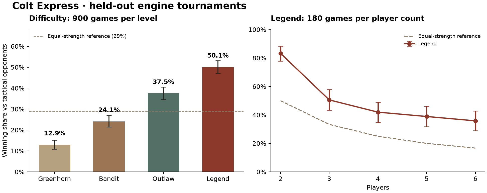

# Express64 model card

## Intended use and status

A local browser opponent for this implementation of the 2016 Colt Express base game, with standard/expert decks and the official two-player team variant. The selected network is used by all four difficulty levels. **No human-strength or universal-superiority claim is supported.** Results measure performance against the implemented engine opponents, and depend on the rules engine being correct.

## Model and training

The policy scores legal actions from a 576-feature observation and 64-feature action encoding. The selected model uses a 64-unit state branch, 24-unit action branch, 32-unit joint layer and separate value head. Tanh activations and exported JSON weights allow direct JavaScript inference without a runtime service. Features include tactical forecasts; this is not a tabula-rasa learner.

The selected checkpoint is width-64 population PPO iteration 900, initialized by imitation learning: **3,840 imitation games + 57,600 PPO games** in its direct training lineage. Across all six experimental runs, training generated **199,680 games and 19,479,876 learner decisions**. Some runs warm-started from earlier checkpoints, so these totals describe computation, not independent training examples. Training used PyTorch on an Apple M1 Max CPU, two threads per process.

Selection compared two imitation widths, 40 PPO checkpoints, and planning variants on validation seeds. The selected policy scored 41.58% on 600 validation games; its eight-world, top-three-action neural planning variant scored 47.17%. Longer tactical rollouts did not improve the initial paired comparison and were rejected. Validation was used for selection and is not the final estimate of strength.

The exact shipped file is `public/models/champion.json`:

```text
SHA-256 bb904d8c3171e9281c42a291abd33952c7885c30f10f7a834bca770427456c6d
```

Export parity passed 100 probes against the PyTorch checkpoint, with maximum absolute error **0.00000503**, below the 0.0001 threshold. See [export-parity.json](experiments/export-parity.json).

## How the difficulties work

| Level | Decision policy |
| --- | --- |
| Greenhorn | Temperature 1.5; 30% random legal mistakes |
| Bandit | Temperature 0.5; 15% random legal mistakes |
| Outlaw | Temperature 0.08 |
| Legend | Sample eight hidden worlds, compare up to three policy candidates, roll out to the next round's first own decision and evaluate with the learned value head |

The same implementation runs in the benchmark and browser worker. Legend is root information-set Monte Carlo planning, not a full IS-MCTS tree. Worlds are sampled from the observation, never from the real hidden state or future random seed. All simulated actors receive their own observations.

## Held-out performance

The model and Legend settings were frozen before the release tournament. Each standard-rule result below uses 900 games, evenly divided among 2–6 players and cycling seats. Winning credit is divided among tied winners. The equal-strength reference is 29%; it is a mathematical reference, not a measured random policy. Confidence intervals use 10,000 bootstrap resamples within player-count strata.

| Difficulty vs tactical | Games | Winning share | 95% interval |
| --- | ---: | ---: | ---: |
| Greenhorn | 900 | 12.94% | 10.83–15.17% |
| Bandit | 900 | 24.11% | 21.50–26.89% |
| Outlaw | 900 | 37.50% | 34.56–40.50% |
| Legend | 900 | **50.11%** | **47.06–53.17%** |

The initial temperature-only Bandit setting scored 37.89%, too close to Outlaw. Its 15% mistake rate was therefore calibrated after that initial comparison, and evaluated on **three new 300-game seed blocks**. Initial results and protocol are retained as calibration evidence. The table uses only the new Bandit games. No network or Legend retuning used these holdouts.

Legend's paired improvement over Outlaw is **12.61 percentage points**, with a bootstrap interval of **8.44–16.72 points**. Pairing is by setup seed; different decisions can cause later random-event paths to diverge.

| Players | Legend games | Winning share | 95% interval | Equal-strength reference |
| --- | ---: | ---: | ---: | ---: |
| 2, team variant | 180 | 83.33% | 77.78–88.33% | 50.00% |
| 3 | 180 | 50.56% | 43.33–57.78% | 33.33% |
| 4 | 180 | 41.94% | 34.72–48.89% | 25.00% |
| 5 | 180 | 38.89% | 31.67–46.11% | 20.00% |
| 6 | 180 | 35.83% | 28.89–42.78% | 16.67% |

The high two-player result materially raises the aggregate; the per-player table is essential when interpreting 50.11%.

| Additional Legend tournament | Games | Winning share | 95% interval |
| --- | ---: | ---: | ---: |
| Aggressive baseline, standard 2–6 | 300 | 42.17% | 36.83–47.33% |
| Greedy baseline, standard 2–6 | 300 | 80.00% | 75.67–84.33% |
| Previous Express32 policy, standard 2–6 | 300 | 44.00% | 38.67–49.33% |
| Tactical baseline, expert 3–6 | 480 | 45.83% | 41.46–50.21% |

The expert equal-strength reference is 23.75%, because two-player games are excluded. The earlier Express32 comparison is against its policy-only setting, not a claim that every search configuration was beaten. There are 4,980 games in the final report plus 900 retained initial Bandit calibration games.



## Limits and next experiments

- No human trial, external competition, exploitability estimate or equilibrium guarantee. Training longer alone cannot establish that the agent beats every human.
- The model uses feedforward features, including only the first 32 queue entries. It has no learned recurrent memory or complete opponent-belief model.
- Uniform hidden-card and purse beliefs omit strategic inference from earlier play. Determinization can still cause strategy-fusion errors despite the observation boundary.
- The value head was learned for the training population; unfamiliar human strategies may expose weaknesses. Handcrafted opponents are limited proxies for people.
- Search is deliberately small for browser responsiveness. Its validation average was about 35 ms per searched decision on the development machine; phones and cold starts may differ.
- Stronger evidence would require pre-registered human matches, larger independent opponent leagues, recurrent/belief-aware policies and controlled search-budget comparisons.

## Reproduction and provenance

[Training instructions](docs/TRAINING.md) describe the stack, seeds, hyperparameters and commands. [protocol.json](experiments/protocol.json) freezes the model hash and all tournament jobs. [summary.json](experiments/summary.json), per-game [results](experiments/results), [training-summary.json](experiments/training-summary.json), checkpoint validation and training curves preserve the evidence. Python checkpoints remain in the local ignored run directory; the selected browser weights and previous comparison weights are committed.

New training runs record full configuration. The earliest pre-config-logging runs retain their metrics and documented recipe; exact floating-point trajectories are not promised across hardware/library versions. The tournament is reproducible directly from the committed weights without retraining.
