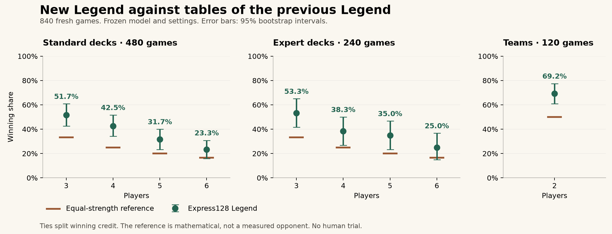

# Express128 planning-league model card

## Intended use and status

A local browser opponent for this implementation of the 2016 Colt Express base game, supporting standard/expert decks and the official two-player team variant. All four difficulty levels use the selected network. **No human trial or claim of beating every human is supported.** Engine-opponent results depend on the implemented rules and opponent population.

This release follows a report that the previous opponent was easy to beat. It changes the representation, training population, planning algorithm and evaluation process, alongside substantially more training. The previous [Express64 model card](https://github.com/truizlop/ColtExpress/blob/dd0e224/MODEL_CARD.md) remains historical evidence; its 50.1% result against a tactical baseline is not a result for this release.

## Model and training

The network scores legal actions from **1,280 observation features and 192 action features**, with a 128→128 state branch, 64-unit action branch, 128→64 joint branch, policy and action-value heads, and a separate 64-unit value branch. Tanh activations and JSON weights permit direct JavaScript inference in a browser worker. Features include the public action queue, destinations, targets, character powers, team relationships and tactical forecasts. This is not a tabula-rasa learner. The real hidden hands, purse values and future random seed never enter its observation.

The selected checkpoint is `v2-planning-league/ppo-00256`, initialized by imitation of the previous policy, followed by stable-league PPO and a branch with stronger tactical and planning opponents. Its **direct new lineage is 46,080 games and 3,657,654 learner decisions**. Across six principal experimental branches, the improvement campaign generated **320,512 additional games and 26,075,617 learner decisions**. Warm starts reuse earlier experience; these are computation totals, not independent examples or all training of the final network. The teacher's earlier training is separate.

| Completed branch                              |   Games | Learner decisions |
| --------------------------------------------- | ------: | ----------------: |
| Richer-feature distillation                   |   5,120 |           673,376 |
| Larger-policy PPO, including its continuation |  65,536 |         5,307,629 |
| Longer-training Express64 control             | 196,608 |        16,078,150 |
| Action-value trace experiment                 |  12,288 |         1,017,141 |
| Planning-opponent league                      |  24,576 |         1,647,150 |
| Frozen-policy value calibration               |  16,384 |         1,352,171 |

Training used PyTorch on an Apple M1 Max CPU, one or two threads per process. Stable per-game opponents, historical anchors and a checkpoint pool reduce reliance on a single opponent. PPO uses player-count-specific advantage normalization, KL monitoring and an objective combining 90% winning credit with 10% final-score utility. Frozen simulator snapshots, optimizer/random-state restoration and seed audits make experiments traceable. See the [training guide](docs/TRAINING_V2.md) and [archived configurations and metrics](experiments/v2/training-summary.json).

## Selection before the final tournament

Development tested training duration, larger features, league composition, value-only calibration, action-value targets, search distillation, temperatures, checkpoint averaging, rollout opponents, horizons and search budgets. More training or more search did not consistently improve results. Development scores were used for selection, not the release-strength estimate.

Four finalists then played independent selection seeds. Every other seat used the exact released Express64 Legend with eight sampled worlds and three policy candidates. Each candidate played 240 standard and 120 expert games, evenly divided among 3–6 players with rotating seats. The candidate with the highest pooled winning credit was selected.

| Candidate with 12-world planning   |   Standard |     Expert | Pooled selection |
| ---------------------------------- | ---------: | ---------: | ---------------: |
| Larger-policy PPO, iteration 128   |     29.38% |     38.33% |           32.36% |
| Value calibration, iteration 64    |     35.42% |     35.83% |           35.56% |
| Larger-policy PPO, iteration 512   |     38.33% |     35.00% |           37.22% |
| **Planning league, iteration 256** | **37.08%** | **42.50%** |       **38.89%** |

The old Legend reference scored 21.46% standard and 24.17% expert on those same setups. Selection chose one candidate; the small gap between the leading candidates does not prove universal superiority. [Selection decision](experiments/v2/selection-decision.json), [standard analysis](experiments/v2/selection-standard-analysis.json) and [expert analysis](experiments/v2/selection-expert-analysis.json) preserve the comparison.

## Difficulties and planning

| Level     | Decision policy                                                          |
| --------- | ------------------------------------------------------------------------ |
| Greenhorn | Policy temperature 1.5; 30% random legal mistakes                        |
| Bandit    | Policy temperature 0.25; no injected random mistakes                     |
| Outlaw    | Four sampled worlds, two initial trials per candidate, three finalists   |
| Legend    | Twelve sampled worlds, four initial trials per candidate, four finalists |

The planner compares legal actions in paired sampled hidden worlds, considering up to 16 initial candidates. For larger sets, policy and action-value rankings supply the shortlist. Each simulated opponent keeps a coherent style within its world: neural policy, tactical or aggressive. Rollouts stop at the observer's first decision in the next round and use the learned continuation value. This is **root information-set Monte Carlo planning**, not a full IS-MCTS tree or AlphaZero.

Worlds are sampled only from the observation. Simulated actors receive their own observations. The final tournament calls the same `difficultyChoice` function as the browser worker. The legacy v1 difficulty implementation is preserved for exact comparison with the previous release.

The four levels provide different randomness and planning budgets. This release's independent strength tournament evaluates Legend; a complete independent ranking of all four new levels has not been established.

## Final independent evaluation

After selection, all weights and difficulty settings were frozen. The final tournament used **840 previously untouched games**: 480 standard, 240 expert and 120 two-player team games. Every other seat ran the previous release’s strongest Legend configuration. Seats rotated evenly within each table size; winning credit is split for ties. The 95% intervals use 20,000 bootstrap resamples within player-count strata.

| Suite vs old Legend   | Games | New Legend winning share | 95% interval | Equal-strength reference |
| --------------------- | ----: | -----------------------: | -----------: | -----------------------: |
| Standard, 3–6 players |   480 |               **37.29%** | 33.12–41.46% |                   23.75% |
| Expert, 3–6 players   |   240 |               **37.92%** | 32.08–44.17% |                   23.75% |
| Two-player teams      |   120 |               **69.17%** | 60.83–77.50% |                   50.00% |

The reference is mathematical equal-strength play, not a measured random policy or a paired old-versus-old holdout. The standard and expert averages weight each table size equally. The two-player result is kept separate so it cannot inflate the multiplayer estimate. This comparison establishes improvement against the prior release in these suites, not against human players.

| Players | Standard, 120 games per size | Expert, 60 games per size | Equal-strength reference |
| ------- | ---------------------------: | ------------------------: | -----------------------: |
| 3       |        51.67% (42.50–60.83%) |     53.33% (41.63–65.00%) |                   33.33% |
| 4       |        42.50% (34.17–51.67%) |     38.33% (26.67–50.00%) |                   25.00% |
| 5       |        31.67% (23.33–40.00%) |     35.00% (23.33–46.67%) |                   20.00% |
| 6       |        23.33% (15.83–30.83%) |     25.00% (15.00–36.67%) |                   16.67% |

Parentheses contain 95% intervals. Six-player intervals overlap the equal-strength reference, so improvement specifically at six players is less certain than the aggregate result. These intervals describe this fixed opponent suite and do not account for all possible rules or human strategies.



[Full analysis](experiments/v2/final-analysis.json) and [per-game results](experiments/v2/results) retain the evidence. No weights or difficulty budgets were changed in response to these outcomes.

## Runtime and validation

On 92 legal observations spanning all player counts and decision phases, quiet single-thread Node measurements on the development machine were:

| Level     | Mean decision time | 95th percentile |
| --------- | -----------------: | --------------: |
| Greenhorn |            0.30 ms |         0.70 ms |
| Bandit    |            0.33 ms |         0.51 ms |
| Outlaw    |            54.2 ms |        170.0 ms |
| Legend    |           163.2 ms |        478.9 ms |

These are [decision-function measurements](experiments/v2/browser-policy-latency.json), not mobile-device benchmarks or animation times. The larger search is slower than the old Legend (32.9 ms mean on the same positions), and runs in a worker to keep interface rendering separate.

The shipped file is `public/models/champion.json`:

```text
SHA-256 06cda0d0fd8fa86a3b856e1ee8166368f2031b8738fd050a1005662aa5d3fb00
```

The release model, game/AI source, evaluator, difficulty settings and final seed protocol were frozen in **commit `fa87041` before final testing**. The source hash is `e90a72c8f0e09e349ee2572603195585f93e437b9458e2a615b2d26c6ed36b49`. Later documentation or result commits do not change those frozen inputs.

PyTorch/JavaScript export parity passed **200 probes**, including 100 real legal observations across all supported player counts and choice/cover/execution/retention/planning phases. Maximum absolute error was **0.00000743**, below 0.0001. [Export evidence](experiments/v2/export-parity.json). Local validation also passed 64 automated tests, production compilation, exact interrupted-training/resumed-arena checks, and sequential/parallel tournament equivalence. [Browser QA](docs/QA.md) covers desktop/mobile gameplay and match downloads.

## Limits and human feedback

- No human trial, external competition, exploitability estimate or equilibrium guarantee. Neither training volume nor engine win rates prove that the agent beats expert humans.
- The feedforward model has no learned recurrent memory or complete opponent-belief model. Uniform hidden-world assumptions omit strategic inference from earlier play and can create strategy-fusion errors.
- The learned value and rollout population can fail against unfamiliar strategies. The final comparison measures improvement against one prior released opponent, not robustness to every possible opponent.
- Search is bounded for browser use. Mobile hardware, thermal limits and cold starts can increase decision times. Large six-player queues require more work.
- Rules-engine errors would affect training and evaluation together. Seed isolation and numerical parity cannot establish rules correctness by themselves.

Completed games now offer **Save match**. The download records the initial state, moves, difficulty, model hash and final result; nothing is uploaded. The replay command checks that the record reproduces the exact result. Old saves captured midway through a match are explicitly marked partial. These records support investigation of human-discovered weaknesses; they do not automatically train the model. Future human evaluation should reserve entire fresh matches separately from training feedback.

## Reproduction

Install the tools described in [TRAINING.md](docs/TRAINING.md), then run:

```sh
pnpm ai:build
.venv/bin/python training/benchmark_v2.py --jobs 8 --chunks 16
```

The runner checks source, model and tooling hashes against the frozen [protocol](experiments/v2/protocol.json), resumes interrupted ranges, and writes to an ignored reproduction directory. Committed browser weights are sufficient to reproduce the tournament without retraining. Python checkpoints remain local in the ignored run directory; exact floating-point training trajectories are not promised across hardware or library versions.
