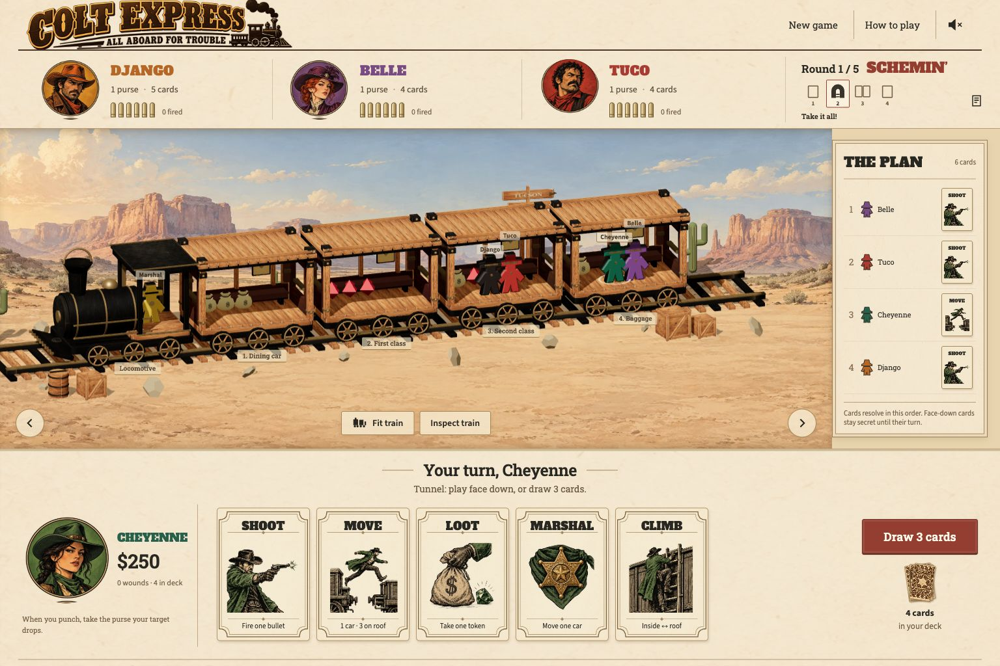

# Colt Express

A playable tabletop train heist, built with React and Three.js. Choose a bandit, program your moves, and rob a moving train against locally trained neural opponents.

**[Play in your browser](https://truizlop.github.io/ColtExpress/)** · [Rules coverage](docs/RULES.md) · [AI model card](MODEL_CARD.md) · [Training](docs/TRAINING.md)



## Play

- One human and **1–5 AI opponents**. The official two-player variant gives each side two bandits.
- All six base-game characters, five rounds, special powers, round events, hidden cards, shooting, punching, loot and the marshal.
- Standard and expert deck rules, four difficulty levels, automatic local save/resume, game history and built-in help.
- A detailed cutaway 3D train, original illustrated cards and portraits, mobile carriage navigation, keyboard controls and reduced-motion support.
- Runs entirely in your browser. No account, inference service or API key. Your saved game stays on that browser and origin.

This is an unofficial fan implementation of the **2016 base game**, not an expansion collection. Game design is by Christophe Raimbault; Colt Express is published by Ludonaute. The application uses original generated illustrations and procedural 3D geometry. See [asset credits](docs/design/ASSETS.md) and [notices](public/NOTICE.txt).

## Run locally

Node 22+ and pnpm 11.19:

```sh
pnpm install --frozen-lockfile
pnpm dev
```

```sh
pnpm format:check
pnpm test
pnpm build
pnpm preview
```

Python is only needed for training and experiments. The selected model is included in `public/models/champion.json`. [Training instructions](docs/TRAINING.md) cover installation, all six experiment families, export parity and the frozen benchmark protocol.

## AI and evidence

Express64 combines imitation learning, population PPO and, at Legend difficulty, information-set Monte Carlo planning. It only receives information its player can see. The browser and training process share the same TypeScript rules engine.

Six training runs generated **199,680 games and 19.48 million learner decisions**. Model selection compared two widths, PPO schedules, checkpoints and search variants. In 900 fresh standard-rule games per level against a tactical baseline, winning shares were:

| Difficulty | Winning share | Approximate 95% bootstrap interval |
| --- | ---: | ---: |
| Greenhorn | 12.9% | 10.8–15.2% |
| Bandit | 24.1% | 21.5–26.9% |
| Outlaw | 37.5% | 34.6–40.5% |
| Legend | **50.1%** | **47.1–53.2%** |

Games are equally divided among 2–6 players; the equal-strength reference is 29%. Ties split winning credit. Bandit was calibrated after its original setting was too close to Outlaw, then tested on fresh seeds. Network weights and Legend search were frozen before holdout testing.

These are **engine-opponent results, not human trials**. Beating every human has not been established. See the [model card](MODEL_CARD.md) for per-player-count results, other opponents, expert decks, limitations and retained evidence.

## Project structure

- `src/game`: deterministic rules, visibility boundary and legal actions.
- `src/ai`: features, browser inference, difficulty policies and sampled-world planning.
- `src/components`, `src/scene`: accessible game controls and Three.js board.
- `training`: PyTorch training, shared Node bridge, evaluation and report scripts.
- `experiments`: frozen protocol, training curves, per-game results and analysis.
- `docs`: rule sources, design concepts, [visual comparison](docs/design/FIDELITY.md) and [QA record](docs/QA.md).

GitHub Actions verifies formatting, tests and the production build, then deploys `main` to GitHub Pages. Relative assets support the `/ColtExpress/` path. Local release verification includes 56 tests, 300 complete engine simulations, full browser games and production-path model loading.
